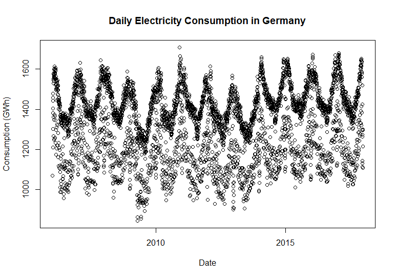
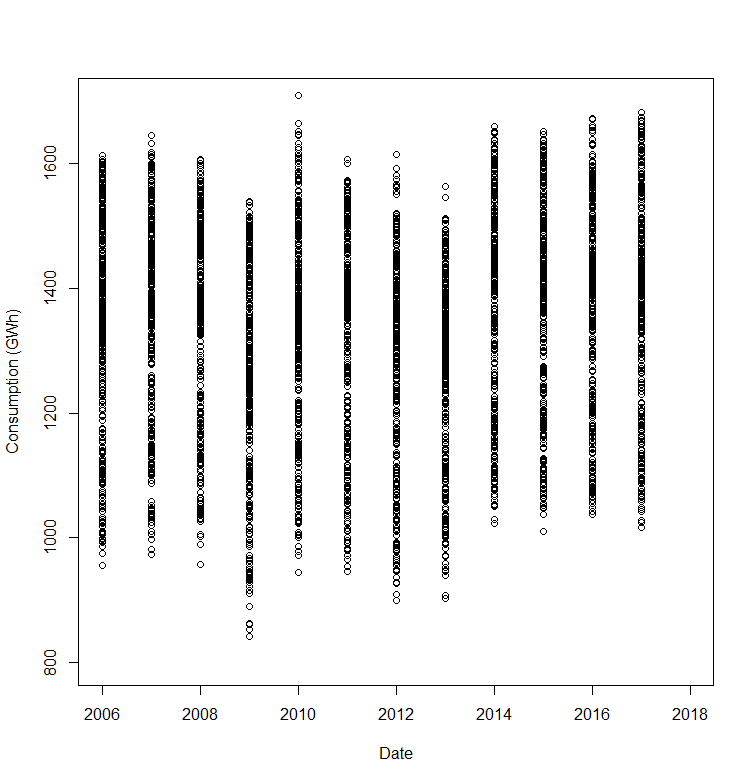
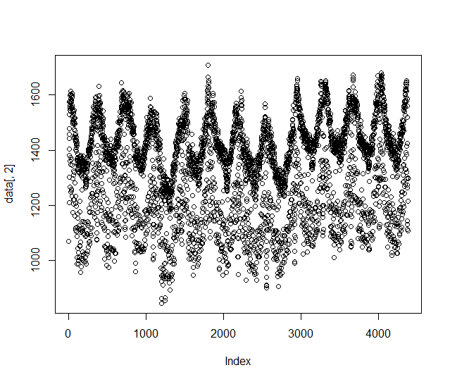
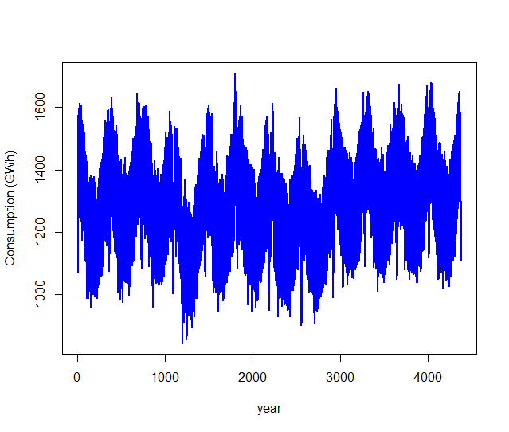
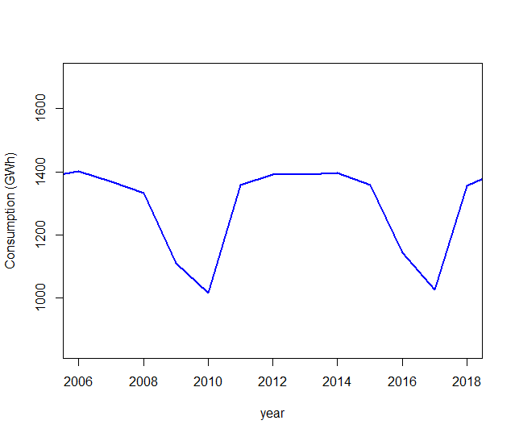
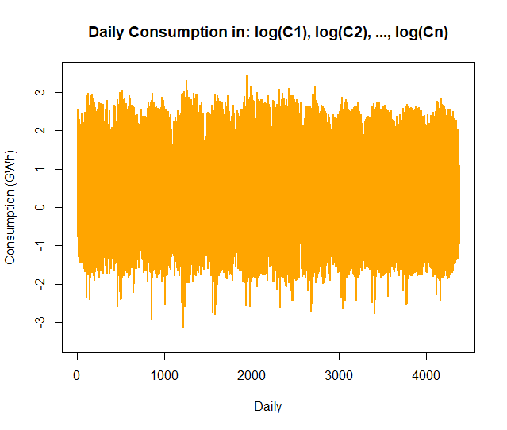
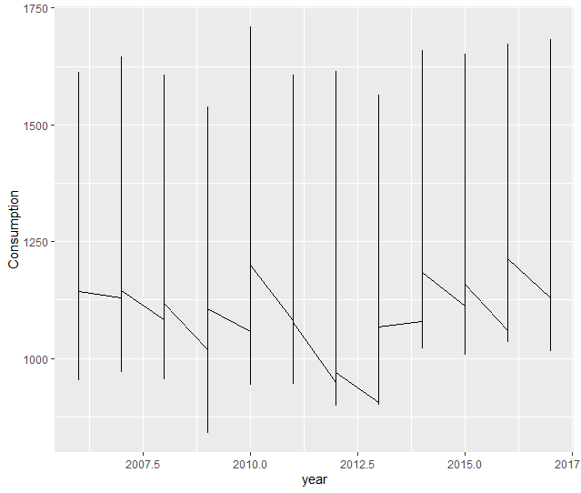
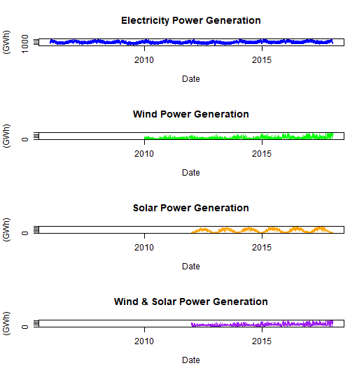

A **time series** is any data set in which values are recorded at different points in time. In many cases, these measurements are collected at regular intervals—for example, hourly weather readings, daily website traffic, or monthly sales figures. However, time series can also be irregular and unevenly spaced, such as computer system event logs or records of 911 emergency calls.

In this module, we will work with energy-related **time series** data to understand how electricity consumption and renewable energy production change over time. Using practical techniques such as **time-based indexing, re-sampling, and rolling window calculations**, we will learn how to analyze patterns, fluctuations, and long-term trends.

# **Data set**: Open Power Systems

```{python}
import kagglehub

path = kagglehub.dataset_download("lailadjebli/opsd-germany-daily")
print("Path", path)
```

> Data set files are downloaded to the specified path and this Data set that reports daily electricity production and consumption in Germany.

### Each record includes:

-   **Date**: Recorded in *YYYY-MM-DD* format
-   **Consumption**: Total electricity consumption (**GWh**)
-   **Wind**: Electricity generated from wind power (**GWh**)
-   **Solar**: Electricity generated from solar power (**GWh**)
-   **Wind + Solar**: Combined renewable energy generation (**GWh**)

### Topics Covered

-   Time series data structures

-   Time-based indexing

-   Visualization of time series

-   Seasonality and frequencies

-   Identifying trends

### Goal of the Analysis

By the end of this module, We will be able to:

-   When is electricity consumption highest or lowest during the year?
-   What long-term trends appear in consumption and renewable energy production?
-   How does renewable energy generation compare with total electricity consumption?
-   How has this ratio evolved over time?

> This approach will help us build a deeper understanding of how energy usage and renewable production behave in real-world conditions.

### Visualize: Consumption over Time

{width="637"}

{width="638"}



](images/clipboard-1812336026.png)

](images/clipboard-3110935428.png)

](images/clipboard-851983445.png)



{width="637"}
